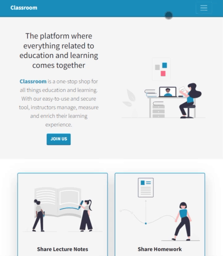
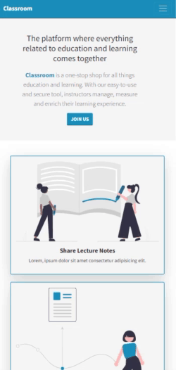

# Classroom App

Here is the google classroom clone application.

I cloned it as logic, not design.
I used Node, React, MongoDB, bootstrap while making the project.

To summarize the project;

Teachers; can open classes, publish course resources and assign assignments.
Students can join the class. They can add their homework as a project.
Teachers will evaluate these projects and give grades to these projects. They will also be able to download it as an excel file.

[Click if you want to try the project online.](https://google-classroom-app.netlify.app/)

---

## REQUESTS

### Teachers ;

- can create a classroom
- can share posts in the classroom
- can see the student list
- can give homework
- homework may have a deadline
- can list those who do and those who do not do homework
- can give points to students' homework
- can download the scores of the whole class in excel file format

### Students;

- can attend classrooms
- can share a post
- can see the homework given by the teacher
- can add his project to the homework
- can see other posts shared in the classroom

### Classrooms ;

- the class access code is generated when the teacher creates a class
- students can join classes with this access code

If you want to try the project in your local;
Create .env files into the backend and frontend folders.

backend/.env

```bash
MONGO_DB_URL= <your_mongo_db_url>
CLIENT_URL= <client_url>

# token

SECRET_ACCESS_TOKEN= < access_token_key >
ACCESS_TOKEN_EXPIRE= < expiration_time >
SECRET_REFRESH_TOKEN= < refresh_token_key >
REFRESH_TOKEN_EXPIRE= < expiration_time >
```

frontend/.env

```bash
REACT_APP_BASE_URL= < backend_url >
```

| Tablet                                         | Mobile                                        |
| ---------------------------------------------- | --------------------------------------------- |
|  |  |


